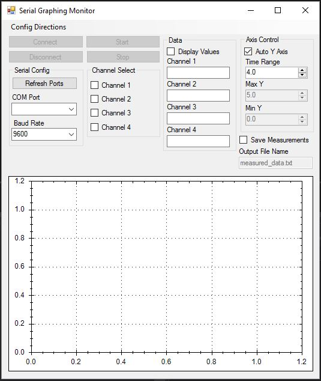

# Serial-Graphing-Monitor-CSharp

Serial Graphing Monitor - C# Windows Forms</b> was written after I developed the graphing program in Python. I found a desire to improve my knowledge of C# so I used this opportunity  to write a program I needed.

In order to run the program you need to install <a href="http://zedgraph.sourceforge.net/samples.html">ZedGraph</a>.

